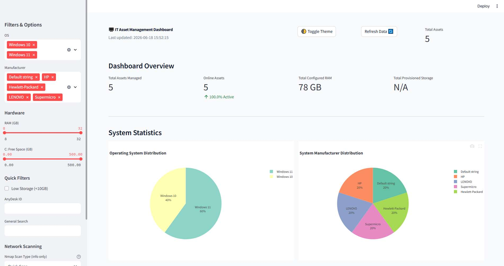
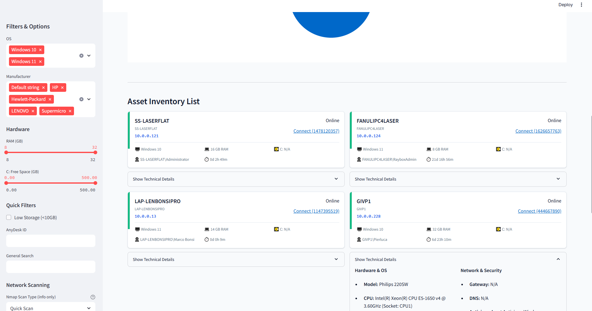

# IT Asset Management Dashboard

A comprehensive Windows PC asset management dashboard built with Streamlit, designed for IT managers to monitor and manage their Windows network infrastructure.

## Screenshots

### Dashboard Overview


### Asset Inventory List


## Features

### Asset Overview
- **Interactive Asset Bubbles**: Visual grid layout displaying all assets with key information.
- **Real-time Status Monitoring**: Online/offline status indicators powered by Nmap integration.
- **Low Storage Alerts**: Visual warnings for assets with less than 10GB free space on the C drive.
- **Clickable AnyDesk Integration**: Direct remote access links for quick troubleshooting.

### Advanced Filtering
- **Operating System**: Filter by Windows versions (7, 8, 10, 11, Server editions).
- **Manufacturer**: Filter by computer manufacturers.
- **RAM Range**: Filter assets by memory amount using interactive sliders.
- **Storage Space**: Filter by available C drive space.
- **AnyDesk ID**: Search by specific remote access IDs.
- **Quick Filters**: One-click filtering for low storage assets.
- **Global Search**: Search across all asset properties.

### Detailed Asset Information
Complete asset details including:
- **System Information**: Manufacturer, Model, BIOS Version, Serial Number.
- **Operating System**: Version, Activation Status, Language, Install Date, Uptime.
- **Hardware Details**: CPU, GPU, RAM (with Italian decimal support), Storage Devices.
- **Network Configuration**: IP Address, MAC Address, DHCP/Static mode, DNS Servers, Gateway.
- **Nmap Integration**: View detailed network scan status and raw output.
- **Software Inventory**: Office Version, Antivirus, Adobe/Autodesk, and a full list of installed programs (exportable to CSV).
- **Security Information**: BitLocker status, Stored credentials, Shared folders.

### System Statistics
- Operating System distribution pie charts.
- Manufacturer distribution visualization.
- Asset status (Online/Offline/Unknown) distribution charts.
- Hardware utilization metrics and storage capacity analysis.

### Windows 11 UI
- Light/Dark theme toggle.
- Modern Windows 11-inspired color scheme and typography.
- Responsive design optimized for IT workflows.
- Professional, clean dashboard layout.

## Installation for Windows 10/11

### Quick Install
1. Download all files to a folder on your Windows PC.
2. Double-click `install.bat` to install dependencies.
3. Double-click `ITAssestTrackerbyAmila.bat` (or `run_dashboard.bat`) to start the dashboard.
4. Open your browser to `http://localhost:5000`.

### Manual Installation
```bash
# Install Python 3.8+ if not already installed
# Then install dependencies:
pip install streamlit pandas plotly

# Run the dashboard:
streamlit run main.py --server.port 5000
```

## Usage

### Setting Up Asset Data
1. Place your Windows PC data files (`.txt` format) in the `assets` folder.
2. Files should be generated by the `infopcv3.ps1` PowerShell script.
3. Click "Refresh Data" in the dashboard to load new asset files.

### Daily IT Management Workflow
1. **Quick Overview**: Check asset bubbles for system status and alerts.
2. **Storage Monitoring**: Use "Show Low Storage Assets" filter to identify systems needing attention.
3. **Remote Access**: Click AnyDesk links for direct remote connections.
4. **Detailed Analysis**: Click asset bubbles or "Show Technical Details" to view comprehensive system details.
5. **Reporting**: Export software inventories as CSV for auditing.

## File Structure
```
IT-Asset-Dashboard/
├── main.py                 # Main dashboard application
├── asset_parser.py         # Asset data parsing engine
├── dashboard_components.py # UI components
├── screenshots/            # Dashboard screenshots for documentation
├── install.bat             # Windows installer script
├── ITAssestTrackerbyAmila.bat # Windows launcher script (with firewall config)
├── assets/                 # Asset data files (.txt)
│   └── .gitkeep
├── .streamlit/
│   └── config.toml         # Streamlit configuration
└── README.md               # This file
```

## Technical Details

### Supported Data Formats
- Windows PC scan files (.txt) generated by `infopcv3.ps1`.
- Italian decimal notation support (e.g., `7,9 GB` → `8 GB`).
- Automatic parsing of system, hardware, software, and network information.

### System Requirements
- Windows 10/11.
- Python 3.8 or higher.
- Internet connection for initial package installation.
- Web browser (Chrome, Firefox, Edge).

### Local Deployment
The dashboard runs entirely on your local Windows PC:
- No external cloud services required for core functionality.
- All data stays on your local network.
- Suitable for enterprise environments with security restrictions.
- Automatic dependency installation and management.

## Troubleshooting

### Common Issues
1. **Python not found**: Install Python from [python.org](https://www.python.org/) and ensure it's in your PATH.
2. **Package installation fails**: Run as administrator or check your internet connection.
3. **No assets displayed**: Ensure `.txt` files are in the `assets` folder and click "Refresh Data".
4. **AnyDesk links not working**: Ensure AnyDesk is installed on your system.

### Support
This dashboard is designed for IT professionals managing Windows environments. All parsing patterns are optimized for standard Windows system information output formats.
