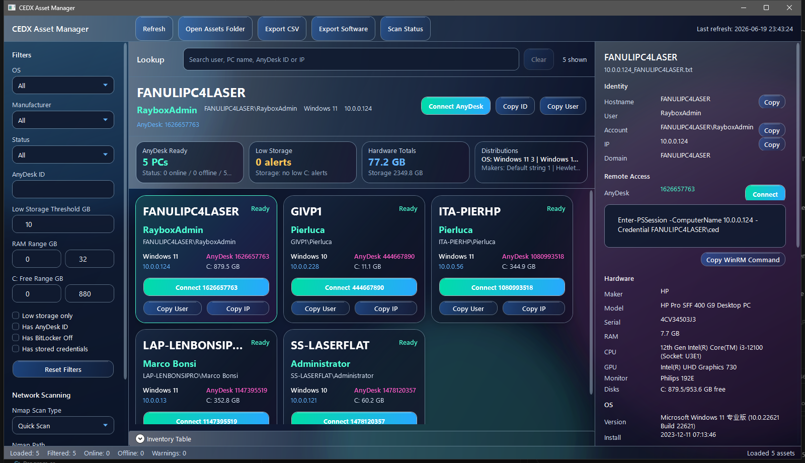
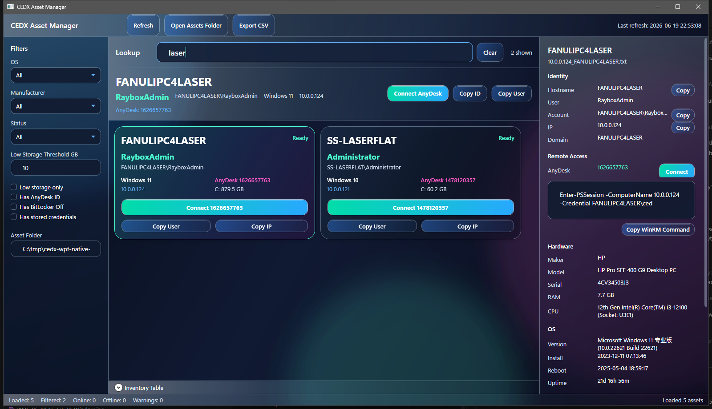

# CEDX Asset Manager

Windows-native IT asset inventory console for local `.txt` scan files. The current WPF branch is focused on the Head of IT call workflow: quickly identify the caller's PC/user and connect through AnyDesk.

## Current UI



The WPF app now uses a liquid-glass Windows desktop shell with:

- tile-first PC lookup for fast caller support,
- prominent hostname, Windows user, OS, IP address, and AnyDesk ID on each tile,
- one-click AnyDesk launch from every tile and from the selected asset strip,
- copy buttons for AnyDesk ID, Windows account, IP, hostnames, and WinRM command text,
- responsive tile packing that expands filtered results instead of leaving empty grid lanes,
- custom dark scrollbars, inputs, combo boxes, checkboxes, and glass buttons,
- range filters for RAM and C: free space, plus quick filters for AnyDesk, BitLocker, credentials, and low storage,
- explicit Nmap status scanning with retained raw output in the selected asset details,
- a right-side asset detail panel for identity, remote access, hardware, OS, network, security, and software fields,
- a collapsible dense inventory table for audit-style scanning.

## Caller Lookup



Use the lookup box to search by PC name, Windows user, domain account, IP address, AnyDesk ID, OS, hardware, installed software, printer name, or source file name. Search and filters run in memory after refresh, so the app does not reparse files while you narrow results during a call.

The screenshots use the sanitized sample files in `assets`. Real deployments can use an `assets` folder or fall back to a local `Database` folder.

## Advanced Operations

- `Scan Status` runs Nmap against loaded asset IPs and updates each tile status.
- The selected asset panel keeps the Nmap output for troubleshooting failed responses.
- `Export CSV` exports the filtered asset inventory with network and security fields.
- `Export Software` exports one CSV row per installed program when scan files contain an `Installed Programs:` section.
- The parser supports both current `Local Disks (Space & Type)` reports and older `Local Disks (in MB)` reports.
- Future scanner output can include `MAC Address:` under `Network Configuration`; the app will parse and search it.

## Build

```powershell
dotnet build .\Cedx.sln
```

## Run

```powershell
dotnet run --project .\src\Cedx.App\Cedx.App.csproj
```

The app looks for an `assets` folder first. If `assets` does not exist, it falls back to the current `Database` folder. `Database` is intentionally ignored by Git because it can contain private network asset data.

## Parser Smoke Check

```powershell
dotnet run --project .\tools\Cedx.ParserSmoke\Cedx.ParserSmoke.csproj -- .\assets
```

Use `.\Database` instead of `.\assets` when validating private local inventory files. The smoke check loads asset `.txt` files and reports parsed RAM, C: free space, MAC address, stored credential, WinRM, and installed-program counts.

## Native App Status

The current WPF slice includes:

- tile-first caller lookup,
- one-click AnyDesk connection from each PC tile,
- selected asset quick-connect strip,
- dense inventory table as a collapsible audit view,
- global search across PC, user, IP, AnyDesk, OS, hardware, software, and printer fields,
- OS/manufacturer/status filters,
- RAM range, C: free range, low storage, AnyDesk, BitLocker Off, and stored credential filters,
- Nmap status scanning with per-asset raw output,
- selected asset details panel,
- inventory CSV and software CSV export,
- copy commands,
- AnyDesk URI launch.

The previous Python/Streamlit files are intentionally preserved until the native app fully replaces them.
