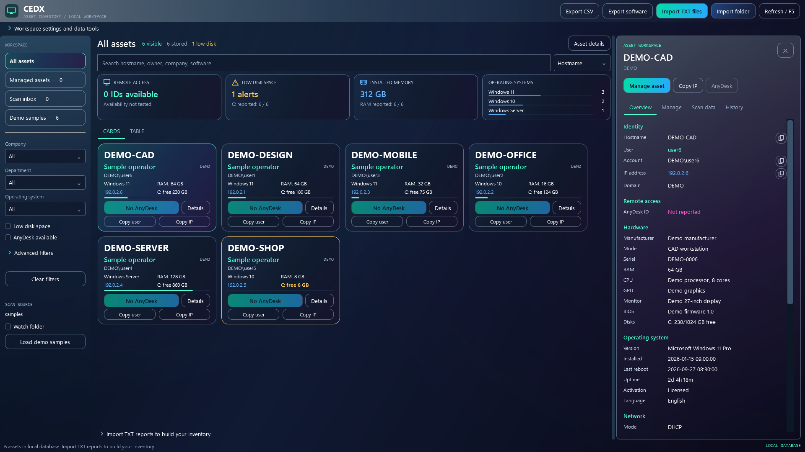
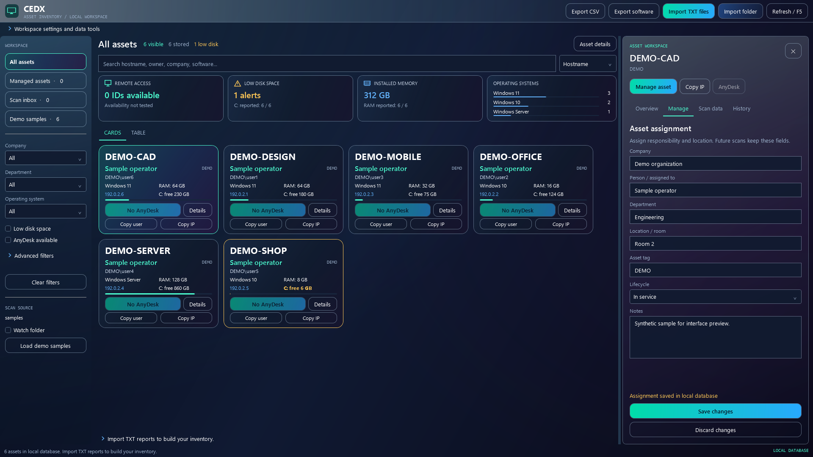
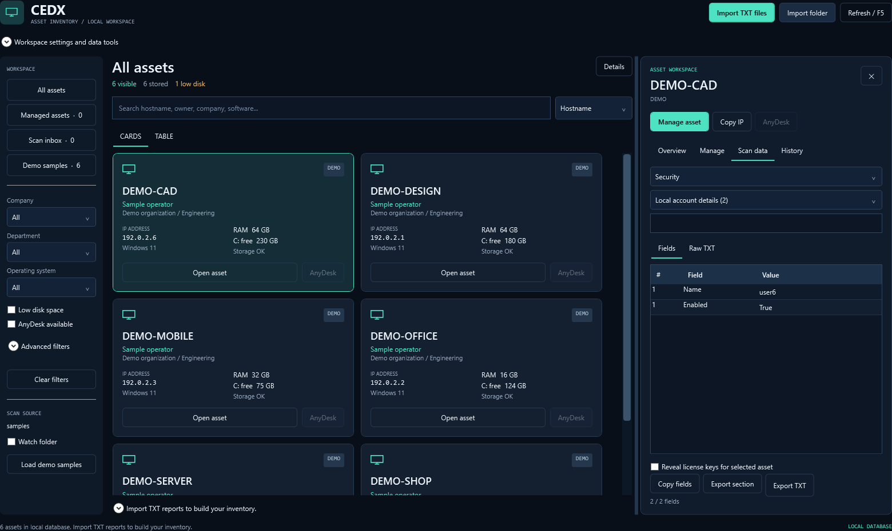
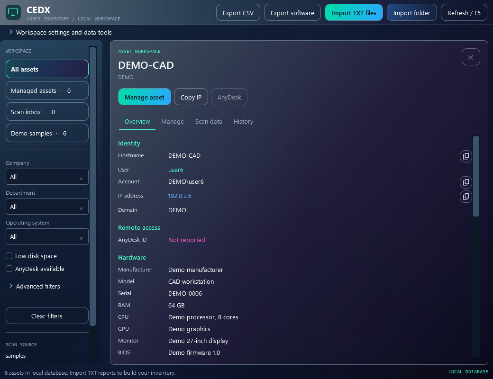

# CEDX · Windows asset workspace

A native WPF inventory application for turning collector TXT reports into a maintained asset register. This branch is `cedxadnacedexe`, based on `cedxadvanced`.

## Run in one click

1. Download **this entire branch** and extract it, or clone and check out `cedxadnacedexe`.
2. Install the **.NET 8 SDK for Windows x64** if it is not already installed.
3. Double-click **Build-and-Run-CEDX.bat**. The first build needs internet access to restore .NET and SQLite packages.
4. Choose **Import folder** for your existing TXT directory, or **Import TXT files** for individual reports. Dragging TXT files or folders into the window also works.

The BAT compiles a self-contained Windows x64 application into `artifacts\cedxadnacedexe`. Keep that entire folder together. After the first build, launch `Cedx.App.exe` directly; the destination PC does not need a separate .NET runtime. Close the application before rebuilding. Build diagnostics are saved in `artifacts\build.log`; `--build-only` skips launch.

## Actual desktop UI

These are WPF renders from the Windows validation workflow, using only synthetic sample data.

## Import, manage, update

1. **Import.** All TXT files in the chosen folder and its subfolders are considered. UTF-8, UTF-8 BOM, UTF-16 LE/BE BOM and legacy single-byte reports are supported. Non-inventory TXT files are rejected with a visible reason. The expandable import log lists each file and result.
2. **Review.** Cards and the sortable inventory table share the same selection. Search covers collected data plus company, person, department, location, tag and notes. Counts show visible versus stored assets. Reset filters restores broad numeric ranges so later machines with more RAM or larger disks are not hidden.
3. **Promote.** Open a scan, select **Manage**, enter company, person, department, location/room, asset tag, lifecycle and notes, then choose **Save as managed asset**. It moves from Scan inbox into Managed assets.
4. **Update.** Import another scan of the same computer. Manual assignments remain intact. Identical content is not duplicated; changed content creates a revision. Older scans are retained in History without replacing the latest snapshot. Revision ordering uses the TXT file modification time.
5. **Monitor.** **Watch folder** watches the selected directory recursively. Newly created, changed and renamed TXT files trigger a debounced import. F5 rescans the folder and reloads the database. A folder that is temporarily unavailable does not remove stored assets.
6. **Export.** Export the filtered inventory as CSV or JSON, installed software as CSV, selected technical fields as CSV, or a stored scan as TXT. Clipboard actions and Ctrl+C on grid cells are available.

Draft assignment edits survive selection changes within the session. They are committed only with Save; closing with unsaved edits prompts before discarding them. Ctrl+S saves the selected assignment, Ctrl+F focuses search, F5 refreshes.

## Built-in database

CEDX uses embedded **SQLite**, not a database server. It is a single-user local workspace.

- Database: `%LOCALAPPDATA%\cedx\assets.db`
- Appearance and last source folder: `%LOCALAPPDATA%\cedx\workspace.json`
- The database contains current raw scans, manual assignments and scan revision history. The app can reopen assets even if the original TXT files have moved or disappeared.
- **Backup database** creates a consistent SQLite backup. To restore, close CEDX, preserve the current database as a rollback copy, and replace `assets.db` with your backup. Reopen CEDX and verify asset count and assignments.
- Matching uses case-insensitive hostname, domain and non-placeholder serial number. It deliberately does not match by IP. Changed hostnames, domains or serial numbers can create a separate asset; review the import log rather than silently merging different devices.
- TXT input is not executed. Nothing is uploaded by CEDX. Local database files and exported reports contain inventory and license information and should be stored accordingly.

Product keys are masked by default in technical views and exports. **Reveal license keys for selected asset** applies to the selected asset and resets on selection change. SQLite backups preserve the original data, including keys; they are not encrypted. JSON is an export format, not a database restore format.

## Samples and layouts

Six clearly labeled synthetic scans are bundled in `samples/`. A fresh empty workspace loads them automatically if no real scans are found. **Load demo samples** makes them available later. Demo samples have their own navigation entry and are excluded from All assets when real assets exist.

Wide windows show a resizable inspector alongside the cards. Compact windows keep the card list usable and open details as a full-width workspace within the content area; the close button returns to cards. Accent, card size and inspector width are customizable. Tabs divide Overview, Manage, Scan data and History, so technical fields do not crowd the assignment form.

AnyDesk requires a local AnyDesk URI handler. Nmap is optional, runs only when requested, and targets valid IP addresses in the filtered set. Live integrations must be verified on the target network. WinRM is a copyable command only.

## Verification and source layout

- `src/Cedx.Core`: legacy and extended TXT parsing, import validation, SQLite persistence, revision history and filtering.
- `src/Cedx.App`: native WPF application, attached collection view replacement, filesystem watcher, assignment editor and export commands.
- `tests/Cedx.Tests`: parser, query, key masking, encoding, transactional imports, deduplication, older-scan handling, assignment persistence and backup checks.
- `tests/Cedx.WpfSmoke`: opens the real WPF window, loads every repository example through Refresh, adds a nested report while watching, saves an assignment, imports an update, reopens storage and checks empty/filtered selections. It renders wide and compact layouts using synthetic data only.

Run `dotnet run --project tests/Cedx.Tests -c Release` and, on Windows, `dotnet run --project tests/Cedx.WpfSmoke -c Release` from the repository root. GitHub Actions also runs the user's BAT in build-only mode. Rendered screenshots and build logs are retained as workflow artifacts.

The original `cedxadvanced` branch is unchanged. To roll back the application, use that branch in a separate checkout. Keep a database backup before replacing newer builds. Legacy Python/Streamlit sources remain in the repository for reference.
