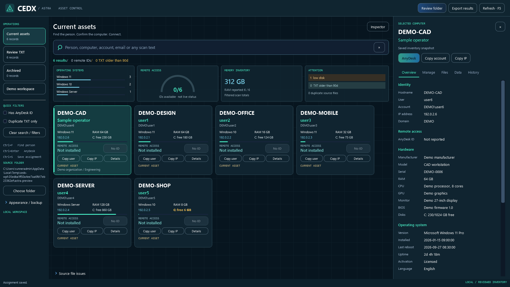
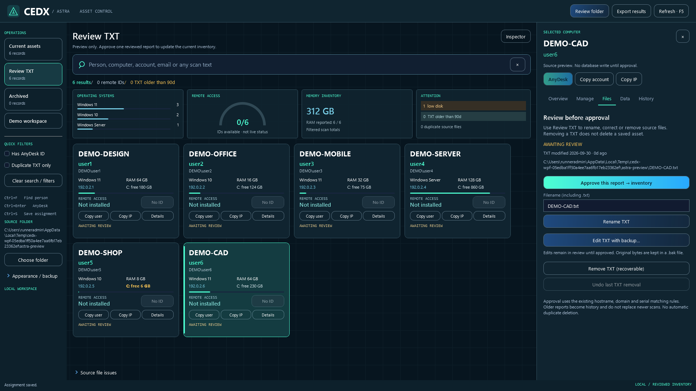
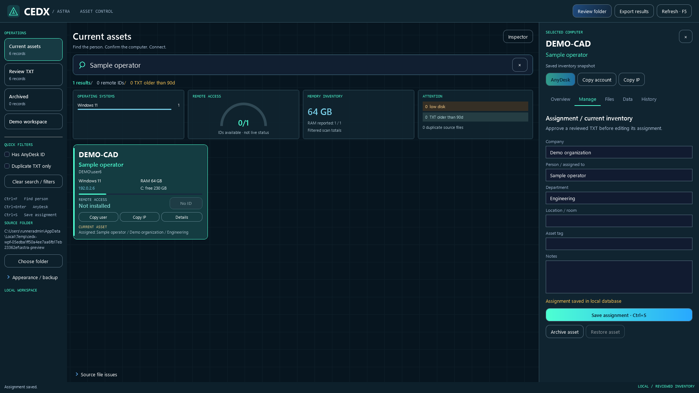
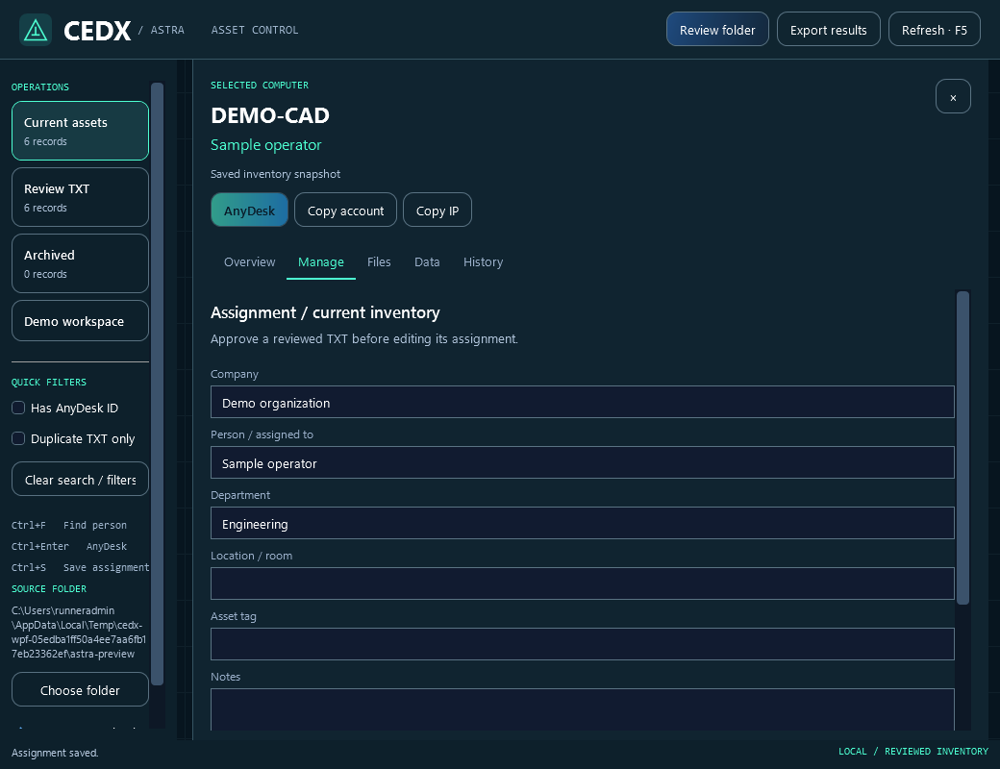
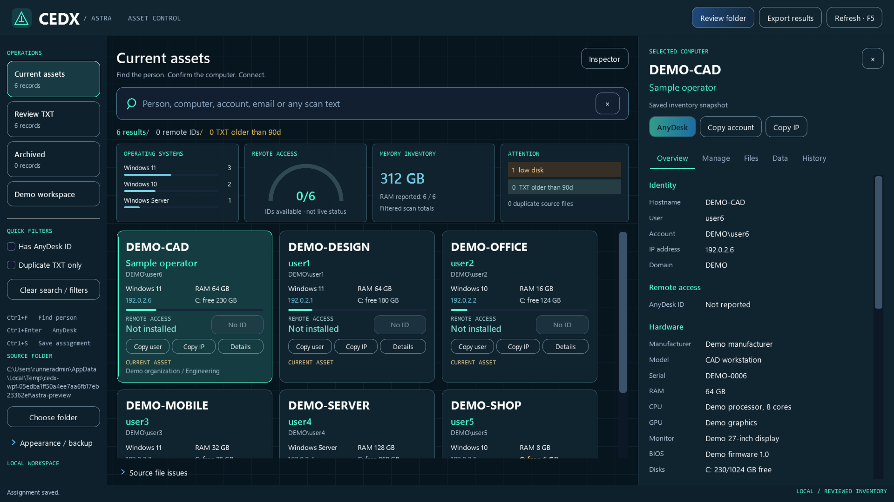

# CEDX Astra mission control

Alternative desktop UI on `cedxadvuirefresh`. It reuses the CEDX parser, SQLite storage, revision matching, technical inspector, assignment editor and AnyDesk command. The classic `Build-and-Run-CEDX.bat` launcher still opens the classic window.

## Launch

1. Download or check out the complete `cedxadvuirefresh` branch.
2. Install the .NET 8 SDK for Windows x64 if needed.
3. Close an already-running Astra build, then double-click `astraui.bat`.
4. The BAT publishes a self-contained build in `artifacts\astra` and starts `Cedx.App.exe --astra`. First build requires package-download access. `astraui.bat --build-only` builds without starting a window. Diagnostics: `artifacts\astra-build.log`.

To reuse the compiled build, launch `artifacts\astra\Cedx.App.exe --astra`. Running the executable without `--astra` opens the classic UI. Keep the entire published folder together.

## Ticket workflow

- Choose **Review folder** once. Astra previews valid TXT reports recursively and watches for additions, changes, renames and removals. Reading the folder does **not** import all reports into SQLite.
- Search using a PC name, Windows account, email, a person's name or other text in the report. Company/person/department assignments are searchable too. Matching is case-insensitive, all typed terms must match, and quoted phrases stay together. Product keys remain excluded from search.
- Confirm the hostname/account/IP on the card and select **Connect**. The existing AnyDesk URI handler must be installed locally. An ID means the report contains a remote identifier; Astra does not claim the computer is online or a session is active.
- **Ctrl+F** focuses search; **Enter** from search focuses results; **Ctrl+Enter** launches AnyDesk for the selected computer. Copy user/IP actions remain on each card.
- **Details** opens Overview, Manage, Files, Data and History. At compact widths the inspector replaces the result area; close it to return to the cards.

## Review, correct, then approve

The two working scopes are deliberately separate:

| Scope | Meaning |
| --- | --- |
| Current assets | Explicitly approved records in the Astra database |
| Review TXT | Live source-file previews; no automatic import |
| Archived | Retired inventory records, including assignments and history |
| Demo | Synthetic bundled previews, not saved to the database |

1. Select **Review TXT**, optionally enable **Duplicate TXT only**, then inspect a card's **Files** tab. Identical report content is flagged separately from multiple reports for the same identity. Newest/older labels use file modification time, not a live device check.
2. **Rename TXT** changes only the filename in its existing directory. The name must include `.txt`. Existing files are never overwritten. Matching stored source references are updated; hostname/account/IP inside the report are unchanged.
3. **Edit TXT with backup** opens the full report, including license fields. Save validates that it is still an inventory report, writes UTF-8 with BOM and keeps the original bytes in a uniquely named `.bak` alongside it. NUL padding is removed from the editor display so it cannot truncate an editable report. An error leaves the editor and typed changes open.
4. **Remove TXT (recoverable)** removes a chosen source from the TXT inventory after confirmation by moving it to a unique `.removed` filename in the same directory. This is not permanent deletion and is not the Windows Recycle Bin. **Undo last TXT removal** restores the last file removed in this session and refuses to overwrite a replacement file. After restarting, recovery files remain on disk; restore a copy to the original `.txt` filename to bring it back into review.
5. File operations check the content hash against the preview. If another process changed the report, refresh and review again. There is no automatic duplicate deletion or bulk approval.
6. **Approve this report → inventory** submits only that selected report to the existing matching engine. Identity is hostname + domain + non-placeholder serial, never IP. Identical reports do not duplicate assets; newer scans update them; older reports become history. Manual assignments survive updates. Approving a report for an archived asset does not automatically reactivate it: use **Restore asset**.
7. In **Manage**, set company, person, department, location/room, tag and notes. Save with the button or **Ctrl+S**. Draft assignment edits survive selection changes in the session; closing with unsaved assignments prompts before discarding them.

Removing a TXT does not delete a saved database record. Use **Archive asset** to remove a retired or unwanted record from the current fleet while retaining its history; **Restore asset** reverses that action. Changing the identity fields inside a report can create a distinct asset, so review the result before archiving the old record.

## Data, appearance and recovery

- Astra database: `%LOCALAPPDATA%\cedx\astra-assets.db`.
- Astra source folder, accent and card size: `%LOCALAPPDATA%\cedx\astra-workspace.json`.
- Classic database remains `%LOCALAPPDATA%\cedx\assets.db`. It is not automatically copied or rewritten. Astra starts a separately reviewed inventory so existing unreviewed imports do not bypass approval. Manual assignments made in the classic database are not automatically transferred.
- The two UIs can point at the same source folder. Renaming/editing/removing a TXT therefore affects that shared folder; their SQLite inventories remain separate. Use a copied folder if you want an isolated trial.
- Appearance/backup in the sidebar offers accent and card-size controls plus **Backup database**. Backups preserve complete raw reports, including license data. To restore: close Astra, preserve the current database, replace `astra-assets.db` with the backup, reopen and verify count/assignments. Source `.bak`/`.removed` files are independent of the database backup.
- **Export results** exports the currently visible cards to CSV, including identity, contact, assignment and source fields. Technical fields can be copied/exported from **Data**. Keys are masked there until explicitly revealed for the selected computer; selection changes reset that choice.
- Gauges/charts use the filtered results: OS counts, available AnyDesk identifiers, reported RAM total, low C: free space (under 10 GB), and TXT files modified more than 90 days ago. None of these is a live health probe. Duplicate source-file count refers to the selected review folder.

## Visual direction and validation

Native WPF cards, vector gauge and grid texture follow the supplied petrol/cyan reference. No screenshot is used as an interactive background, and no online/session figures are invented. Screenshot previews below use synthetic data only.

`tests/Cedx.Tests` covers parser/storage and recoverable source-file operations. `tests/Cedx.WpfSmoke/AstraSmoke.cs` exercises email/account/name/hostname search, explicit approval, assignment persistence, rename, edit-before-approve, archive/restore, duplicate removal/undo, watcher staging, export and responsive renders. Windows CI builds both BAT launchers and also runs the classic UI regressions. The tests validate AnyDesk command availability without opening connections to endpoints; actual AnyDesk registration and network reachability must be checked on the operator's PC.

Final [Windows validation](https://github.com/amilapcsgit/cedx/actions/runs/36683152963) passed all 45 Core checks, both launchers and both WPF flows.

See [ASTRA-PROGRESS.md](ASTRA-PROGRESS.md) for checkpoint commits and the verified Windows run.

## Identifiers used

`cedxadvuirefresh` · `astraui.bat` · `Build-and-Run-CEDX.bat` · `Cedx.App.exe` · `--astra` · `artifacts\astra` · `%LOCALAPPDATA%\cedx\astra-assets.db` · `%LOCALAPPDATA%\cedx\astra-workspace.json` · `%LOCALAPPDATA%\cedx\assets.db`
